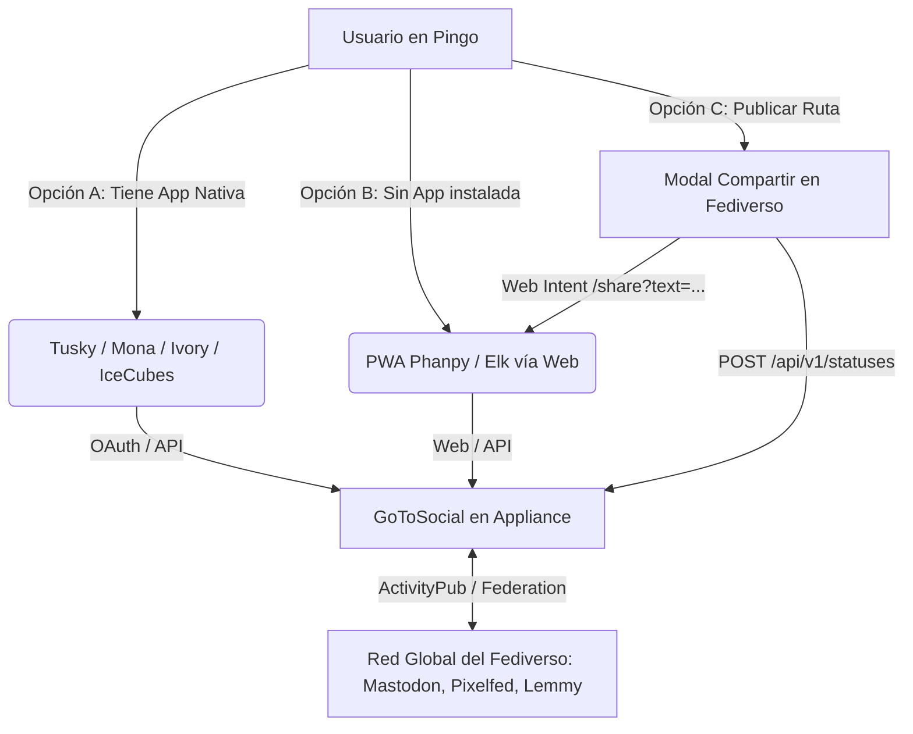
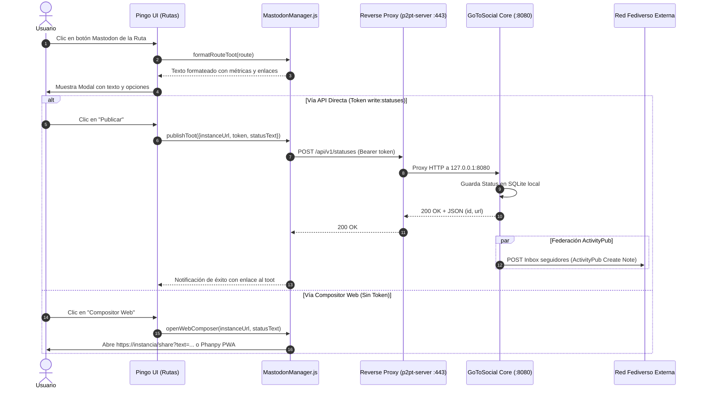

# Integración Mastodon / Fediverso en Pingo

Esta guía detalla la arquitectura implementada para ofrecer tanto **clientes web PWA inmediatos (Phanpy)** como **publicación directa de rutas (Toots con metadata y GPX)** y soporte para **aplicaciones nativas del Fediverso**.

---

## 1. Tres Modos de Experiencia de Usuario



### Modo A: Clientes Nativos (Móvil / Desktop)
* Apps compatibles: **Tusky** (Android), **Mona / Ivory** (iOS/macOS), **Ice Cubes** (iOS/iPadOS), **Whalebird / Elk** (Desktop).
* El usuario simplemente introduce su dominio propio: `tunodo.duckdns.org` y su usuario `@admin@tunodo.duckdns.org`.

### Modo B: Acceso Inmediato PWA (Phanpy)
* Para usuarios que no tienen ninguna app instalada en su móvil o que están en un navegador web:
* Pulsando el botón con el icono de Mastodon en la barra superior de Pingo, se abre directamente **Phanpy PWA**:
  `https://phanpy.social/#tunodo.duckdns.org`
* **Phanpy** es una PWA ultraligera, optimizada para móviles, compatible con GoToSocial y sin necesidad de instalar nada desde tiendas de aplicaciones.

### Modo C: Publicar Rutas Directamente
* En la lista de rutas (`Mis Rutas`), cada elemento dispone ahora de un botón específico con el icono de Mastodon.
* Al pulsarlo, se abre el **Modal de Compartir en Fediverso**, que genera automáticamente un toot con la ficha de la ruta:
  - Nombre del track
  - Puntos GPS y estadísticas
  - Fecha de grabación
  - Enlace directo a Pingo para visualizar o clonar en P2P
  - Hashtags federados (`#pingo #senderismo #gpx #fediverse`)
* Ofrece dos vías de envío:
  1. **Publicar directo:** Mediante el API REST de Mastodon (`POST /api/v1/statuses`) usando un token con alcance `write:statuses`.
  2. **Compositor Web / PWA:** Abre el compositor de la instancia con el texto ya pre-rellenado para editarlo o adjuntar fotos antes de enviar.

---

## 2. Diagrama de Secuencia: Publicación de Ruta



---

## 3. Estructura de Archivos Modificados

| Componente | Archivo | Función |
| :--- | :--- | :--- |
| **Cliente JS** | [`src/js/mastodon-manager.js`](file:///home/jose/workspace/pingo/src/js/mastodon-manager.js) | Lógica de formateo de toot, API REST y lanzador de PWA. |
| **Interfaz HTML** | [`index.html`](file:///home/jose/workspace/pingo/index.html) | Botón de acceso PWA en cabecera y modal de publicación de rutas. |
| **Controlador UI** | [`src/js/ui-manager.js`](file:///home/jose/workspace/pingo/src/js/ui-manager.js) | Eventos del modal, botón en tarjetas de ruta y validaciones. |
| **Handshake P2P** | [`src/js/peer-manager.js`](file:///home/jose/workspace/pingo/src/js/peer-manager.js) | Auto-descubrimiento de la URL de Mastodon desde la config del appliance. |
| **Proxy Go** | [`server/gotosocial_proxy.go`](file:///home/jose/workspace/pingo/server/gotosocial_proxy.go) | Reverse proxy con soporte TLS, CORS y cabeceras ActivityPub. |
| **Servicio OpenRC** | [`server/services/gotosocial`](file:///home/jose/workspace/pingo/server/services/gotosocial) | Script de arranque para Alpine Linux en Raspberry Pi / x86. |

---

## 4. Ejemplo del Toot Generado

```text
🌲 ¡Nueva ruta grabada con Pingo! 🚴‍♂️

📍 "Subida al Pico del Teide"
📊 Puntos GPS: 1420
📅 Fecha: 1/10/2026

Explora el track o sincroniza en P2P:
https://miserver.duckdns.org

#pingo #senderismo #outdoor #gpx #tracks #fediverse #activitypub
```
